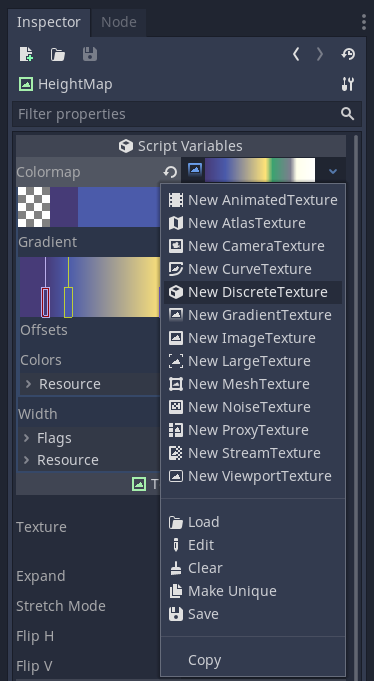

# Godot DiscreteTexture

This addon adds a `DiscreteTexture` resource that builds on top of `GradientTexture`.

## API

It provides this new method:

- `discrete() -> ImageTexture` which uses the `Gradient` resouce to produce an `ImageTexture` as shown in the image

